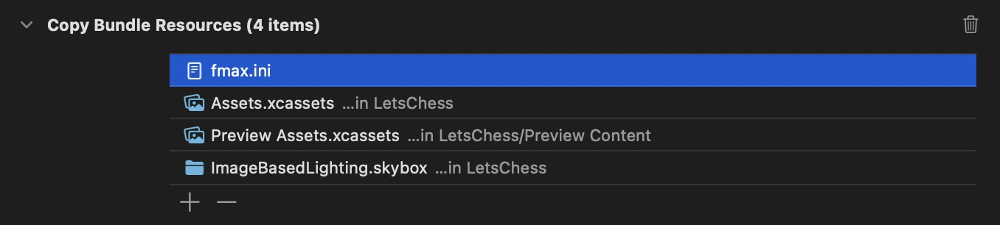

# Micro-Max On Apple Silicon ♟️

[](https://swiftpackageindex.com/mesqueeb/MicroMaxOnAppleSilicon)
[](https://swiftpackageindex.com/mesqueeb/MicroMaxOnAppleSilicon)

```
.package(url: "https://github.com/mesqueeb/MicroMaxOnAppleSilicon", from: "2.1.0")
```

Micro-Max On Apple Silicon is the [µ-Max C Chess engine](https://home.hccnet.nl/h.g.muller/max-src2.html) by H.G. Muller to play Chess games. Built as multi-platform XCframework for iOS, macOS and visionOS. Wrapped as a modernised Swift Package that can be included in any Swift project and can build on all Apple platforms.

## Installation

You can add `MicroMaxOnAppleSilicon` by adding it as a dependency to your `Package.swift` or add it via Xcode by searching for the name.

The library currently relies on a certain file existing in your project's Bundle Resources, so you will need to manually add that before the engine can be used, otherwise you will hit an error:

> fmax.ini not found in the framework bundle.

The `fmax.ini` file is bundled with the files that will get installed with this package:


You then have to copy paste this file into your project's directory and add it to the Bundle Resources of your target:



That's all! Now you can use the engine in your project.

## Usage

```swift
import MicroMaxOnAppleSilicon

let bridge = MicroMaxBridge()

bridge.connectToEngine()

/// You need to feed the engine FEN state strings to be able to request moves
let fenState: String = "rnbqkbnr/pppppppp/8/8/8/8/PPPPPPPP/RNBQKBNR w KQkq - 0 1"

do {
  let (from, to) = try await bridge.requestAiMove(fenState: inputText)
  guard let from, let to else { throw fatalError("no result") }

  print("MicroMax moves from \(from) to \(to)") // Eg. from "B7" to "B6"
} catch {
  print("something went wrong... error:", error)
}
```

The library comes with some useful types and helper functions, be sure to check out the [Swift wrapper's source code here](./MicroMaxOnAppleSilicon/SwiftBridge/).

### Sample Project

There is a sample Xcode project provided as part of the repo that you reference here: [MicroMaxTestApp](./MicroMaxTestApp/).

### Documentation

See the [documentation](https://swiftpackageindex.com/mesqueeb/MicroMaxOnAppleSilicon/documentation/micromaxonapplesilicon) for more info.

## Development

Open the workspace [MicroMaxOnAppleSilicon.xcworkspace](./MicroMaxOnAppleSilicon.xcworkspace) in Xcode to run the test apps and XCTests.

# Other Projects

Also check out Fuego on Apple Silicon ⚫️⚪️, the Fuego Go engine wrapped for Apple Silicon.

→ [github.com/mesqueeb/FuegoOnAppleSilicon](https://github.com/mesqueeb/FuegoOnAppleSilicon)
